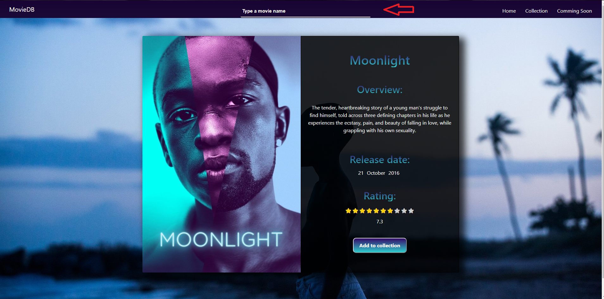
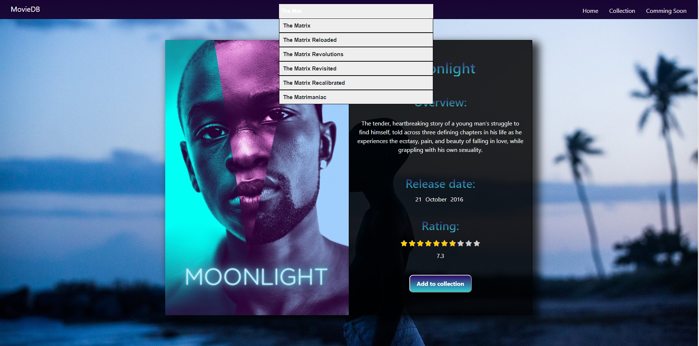
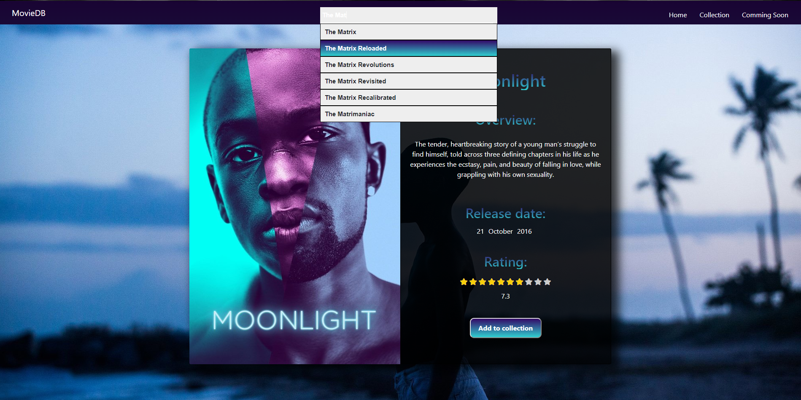
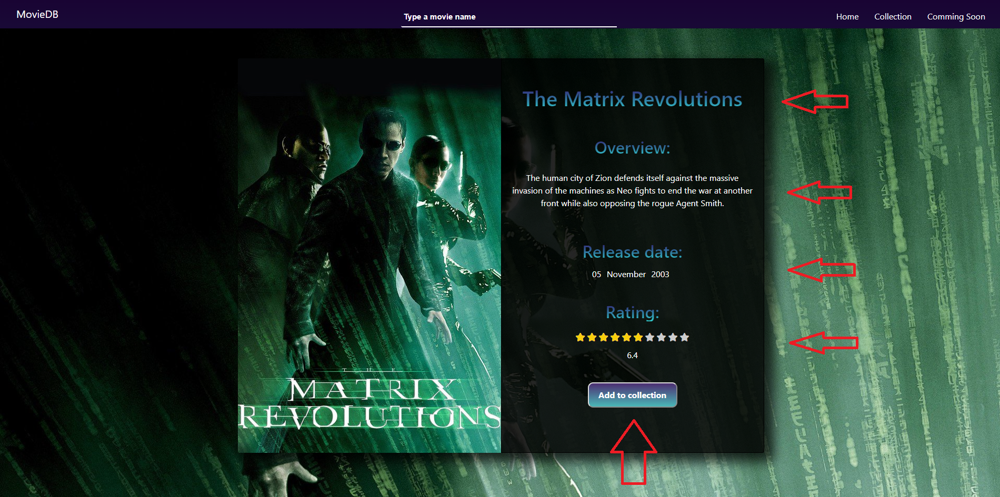
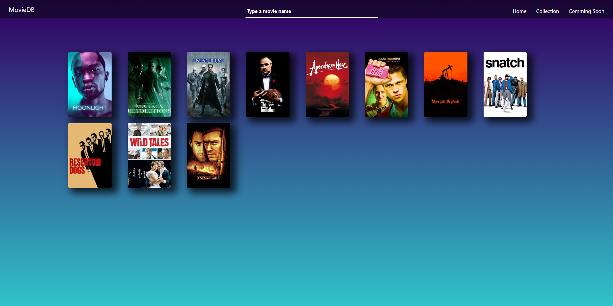

# Movie Database React Routing project

## Description
This is single page application with option to browse through movies database, make and access collection of your favorite movies.There is also new page added with coundown to newest movie premiere release date. Website is build in HTML/CSS and Javascript using ReactJs framework, and react routing to route between different parts of  React application.Its using themovieDB API in JSON format handled by axios and connected with autosuggest.Website is fully responsive across all pages.

## Installation
A step by step of examples  

*If you are using node package manager (npm) first step will be  

`npm install` 

Wait until instalation is finished and type 

`npm start` 

to start live server and preview of app   

*If you are using Yarn first step will be  

`yarn install` 

and after instalation 

`yarn run start` 

## Usage

* Start typing the movie name or its part and get the suggestion list of the most similarly named movies in database . 
Example - The Mat or Matri for The Matrix.
The more precise movie name you put the more precise list you will get.  
  
  
* After you chose desired movie click on its suggestion to get information about it  
  
* It will show you card with movie poster, title, overveiw, release date and Imdb rating. 
Also button to add to your collection of favorite movies   
  
* You can access movie collection by clicking on collection link in navigation bar. 
  
* And access comming soon page to see realase date of new blockbuster! 
  

## Built With

- React.JS - Javascript framework 
- TMDb - Community built movie and TV database 
- Axios - HTTP client  
- React Autosuggest -WAI-ARIA compliant  
- Visual Studio Code - Code editor  

## Author

- **Nikola Stanisavljevic**   :+1:

